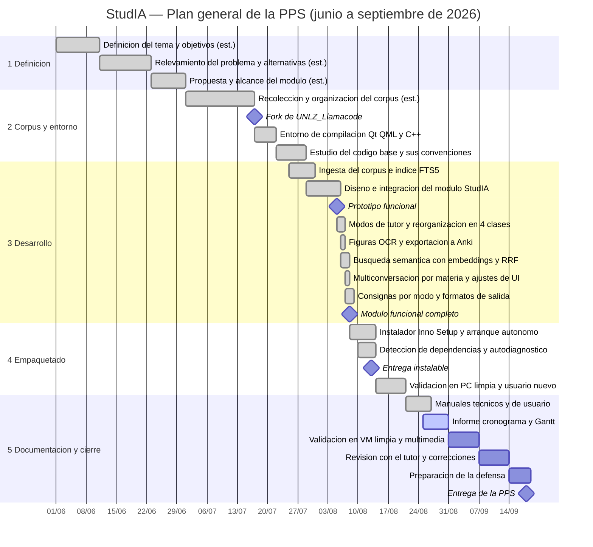
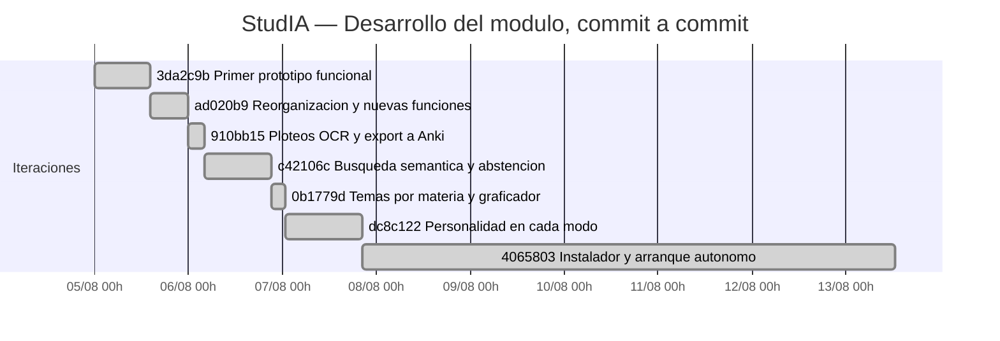

# Diagrama de Gantt — PPS StudIA

**Proyecto:** StudIA — Asistente de estudio sobre corpus académico
**Autor:** De Palma, Marcos Agustin · **Docente / Tutor:** Cristian Lukaszewicz
**Período:** junio – septiembre de 2026 · **Entrega:** 18/09/2026
**Carrera:** Ingeniería Mecatrónica (FI-UNLZ)

Este Gantt no es una estimación hecha a posteriori. Las etapas 3 a 5 se derivan del
historial de commits del repositorio de código
([UNLZ_Llamacode_StudIA](https://github.com/MarcosDePalma/UNLZ_Llamacode_StudIA),
rama `feature/studia`) y de los registros del repositorio local: cada tarea termina
en un commit verificable, con su fecha y su hash. Las etapas 1 y 2 son anteriores al
primer commit y están marcadas como **estimadas**.

---

## 1. Gantt general de la PPS

<!-- fig: gantt -->


---

## 2. Gantt de detalle — desarrollo del módulo (5 al 13 de agosto)

Las barras corresponden a la **ventana entre commits**, con la fecha y hora reales
registradas en el repositorio. No representan horas continuas de trabajo, sino el
tramo de calendario en el que se produjo cada entrega parcial.

<!-- fig: gantt_detalle -->


---

## 3. Tabla de respaldo del Gantt

| # | Etapa / tarea | Inicio | Fin | Evidencia |
|---:|---|---|---|---|
| 1.1 | Definición del tema y objetivos | 01/06/2026 | 10/06/2026 | estimada |
| 1.2 | Relevamiento del problema y alternativas | 11/06/2026 | 22/06/2026 | estimada |
| 1.3 | Propuesta y alcance del módulo | 23/06/2026 | 30/06/2026 | estimada |
| 2.1 | Recolección y organización del corpus académico | 01/07/2026 | 16/07/2026 | estimada · corpus `DATA` (23 GB) |
| 2.2 | **Fork de `cristianlukas/UNLZ_Llamacode`** | 17/07/2026 | — | registro de clonado del repositorio |
| 2.3 | Entorno de compilación (Qt/QML + C++/CMake) | 17/07/2026 | 21/07/2026 | estimada sobre fechas de archivos |
| 2.4 | Estudio del código base y sus convenciones | 22/07/2026 | 28/07/2026 | estimada |
| 3.1 | Ingesta del corpus e índice FTS5 | 25/07/2026 | 30/07/2026 | `tools/studia/ingest.py` |
| 3.2 | Diseño e integración del módulo | 29/07/2026 | 05/08/2026 | commit `3da2c9b` |
| 3.3 | **Primer prototipo funcional** | 05/08/2026 | — | commit `3da2c9b` (18 arch., +3.312 líneas) |
| 3.4 | Modos de tutor y reorganización en 4 clases | 05/08/2026 | 06/08/2026 | commit `ad020b9` (21 arch., +3.375) |
| 3.5 | Figuras, OCR y exportación a Anki | 06/08/2026 | 06/08/2026 | commit `910bb15` (25 arch., +2.778) |
| 3.6 | Búsqueda semántica (embeddings + RRF) | 06/08/2026 | 06/08/2026 | commit `c42106c` (16 arch., +1.174) |
| 3.7 | Multiconversación por materia y ajustes de UI | 06/08/2026 | 07/08/2026 | commit `0b1779d` (14 arch., +1.573) |
| 3.8 | Consignas por modo y formatos de salida | 07/08/2026 | 07/08/2026 | commit `dc8c122` (10 arch., +1.624) |
| 4.1 | Instalador y arranque autónomo del servidor | 08/08/2026 | 13/08/2026 | commit `4065803` (26 arch., +1.796) |
| 4.2 | Detección de dependencias y autodiagnóstico | 10/08/2026 | 13/08/2026 | `StudiaHerramientas`, `instalar_dependencias.ps1` |
| 4.3 | **Entrega instalable** | 13/08/2026 | — | commit `4065803` |
| 4.4 | Validación en PC limpia y usuario nuevo | 14/08/2026 | 20/08/2026 | `installer/PROBAR_EN_PC_LIMPIA.md` |
| 5.1 | Manuales técnicos y de usuario | 21/08/2026 | 26/08/2026 | `INFORMES/manuales/` |
| 5.2 | Informe, cronograma, Gantt y diagramas | 25/08/2026 | 30/08/2026 | este repositorio |
| 5.3 | Validación en VM limpia, capturas y video | 31/08/2026 | 06/09/2026 | planificada |
| 5.4 | Revisión con el tutor y correcciones | 07/09/2026 | 13/09/2026 | planificada |
| 5.5 | Preparación de la defensa | 14/09/2026 | 18/09/2026 | planificada |
| 5.6 | **Entrega de la PPS** | 18/09/2026 | — | — |

---

## 4. Cómo regenerar la imagen

El Gantt está escrito en [Mermaid](https://mermaid.js.org/): GitHub lo renderiza
solo al abrir este archivo. Para obtener el PNG que se inserta en el informe:

```bash
npm install -g @mermaid-js/mermaid-cli
python INFORMES/build_docs.py          # regenera assets/gantt.png y los PDF
```

La imagen queda en [`assets/gantt.png`](assets/) y en
[`assets/gantt_detalle.png`](assets/).
