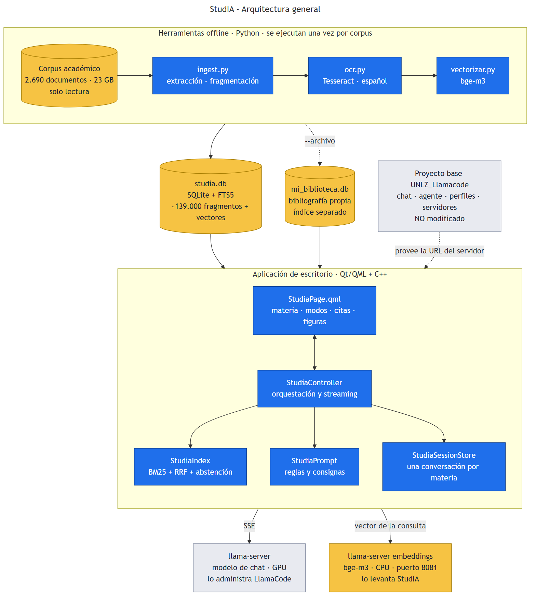
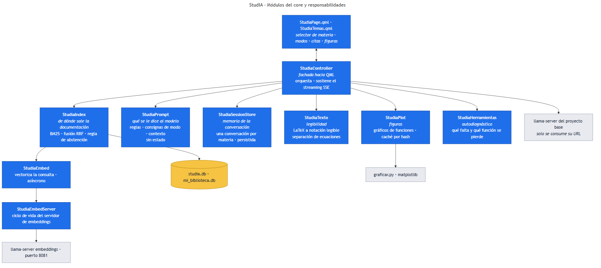
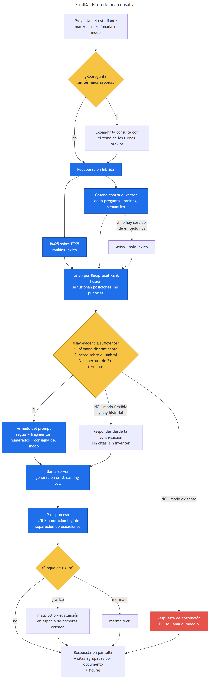
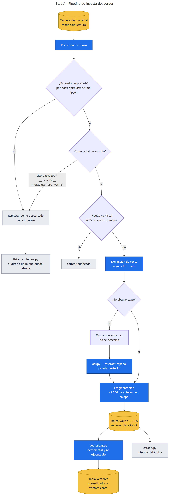

<!-- portada -->


# StudIA — Asistente de estudio sobre corpus académico

## Informe de Práctica Profesional Supervisada

**Universidad Nacional de Lomas de Zamora — Facultad de Ingeniería**
**Carrera:** Ingeniería Mecatrónica
**Tipo:** PPS · **Año:** 2026 · **Cuatrimestre:** 1C

| | |
|---|---|
| **Autor** | De Palma, Marcos Agustin |
| **Materia** | Práctica Profesional Supervisada (PPS) |
| **Docente / Tutor** | Cristian Lukaszewicz |
| **Ámbito** | Cátedra / Facultad de Ingeniería, UNLZ |
| **Período** | junio – septiembre de 2026 · 200 h estimadas (régimen previsto: lunes a viernes, 8:00 a 12:00) |
| **Repositorio de la PPS** | https://github.com/MarcosDePalma/2026_1C_PPS_Asistente_de_Estudio_DE-PALMA |
| **Repositorio del código** | https://github.com/MarcosDePalma/UNLZ_Llamacode_StudIA |
| **Proyecto base** | https://github.com/cristianlukas/UNLZ_Llamacode |
| **Fecha de entrega** | 18/09/2026 |
| **Contacto** | marcosdepalma03@gmail.com · [github.com/MarcosDePalma](https://github.com/MarcosDePalma) |

---

## Resumen

Se desarrolló **StudIA**, un asistente de estudio que responde preguntas **usando
exclusivamente la documentación académica del propio estudiante** —apuntes, libros y
trabajos prácticos de la carrera— en lugar del conocimiento general de un modelo de
lenguaje. El sistema corre **por completo en la máquina del usuario**, sin enviar
material a servicios externos.

El trabajo se implementó como módulo del proyecto institucional
[UNLZ_Llamacode](https://github.com/cristianlukas/UNLZ_Llamacode), una estación de
trabajo de IA local desarrollada en la Facultad. El aporte de esta PPS son **55
archivos y aproximadamente 14.700 líneas** agregadas en 7 iteraciones, sobre un
corpus real de **2.690 documentos** (~139.000 fragmentos indexados), con **322 casos
de prueba automatizados** y un instalador que permite desplegar el sistema completo
en una PC sin herramientas de desarrollo.

La contribución técnica más relevante es el **control de abstención determinístico**:
cuando la documentación indexada no cubre una pregunta, el sistema responde que no
tiene información **sin llegar a consultar al modelo**. La garantía contra respuestas
inventadas no depende, por lo tanto, de que el modelo obedezca una instrucción del
prompt. Calibrado sobre 30 preguntas en lenguaje natural, responde las 16 cubiertas
por el material y se abstiene en las 14 ajenas.

---

## Índice

1. [Introducción](#1-introducción)
2. [Marco tecnológico](#2-marco-tecnológico)
3. [Metodología de trabajo](#3-metodología-de-trabajo)
4. [Desarrollo](#4-desarrollo)
5. [Arquitectura del sistema](#5-arquitectura-del-sistema)
6. [Decisiones de diseño](#6-decisiones-de-diseño)
7. [Validación y resultados](#7-validación-y-resultados)
8. [Dificultades y aprendizajes](#8-dificultades-y-aprendizajes)
9. [Conclusiones](#9-conclusiones)
10. [Trabajo futuro](#10-trabajo-futuro)
11. [Referencias](#11-referencias)
- [Anexo A — Historial de commits](#anexo-a--historial-de-commits)
- [Anexo B — Estructura del aporte](#anexo-b--estructura-del-aporte)
- [Anexo C — Glosario](#anexo-c--glosario)

---

## 1. Introducción

### 1.1 Contexto

Un estudiante de ingeniería acumula, a lo largo de la carrera, cientos de archivos de
material de estudio: apuntes de cátedra, libros, guías de trabajos prácticos,
presentaciones y resoluciones. En este caso concreto, ese material suma **2.690
documentos y 23 GB** distribuidos en carpetas por materia.

Ese volumen es a la vez el activo más valioso del estudiante y su mayor problema
práctico: **la información existe, pero encontrarla cuesta**. El buscador del sistema
operativo indexa nombres de archivo y, en el mejor caso, texto plano; no responde
preguntas, no relaciona conceptos que aparecen en dos apuntes distintos y no distingue
la materia.

Al mismo tiempo, los asistentes conversacionales de propósito general resuelven la
pregunta pero no el problema: responden **desde su conocimiento general**, no desde el
apunte de la cátedra. Para estudiar un final eso es exactamente lo contrario de lo que
se necesita —la respuesta correcta es la que está en el material que se va a evaluar—
y además obliga a subir material académico a un servicio de terceros.

### 1.2 Problema a resolver

> Un estudiante no puede consultar su propio material de estudio en lenguaje natural,
> y las herramientas de IA disponibles responden desde conocimiento general en lugar de
> hacerlo desde ese material, sin trazabilidad de la fuente y sin garantía de que la
> respuesta no sea inventada.

El problema tiene tres dimensiones:

| Dimensión | Manifestación concreta |
|---|---|
| **Acceso** | Encontrar dónde se explica un tema exige recordar en qué archivo estaba. |
| **Confiabilidad** | Una respuesta de un modelo general puede ser plausible y falsa, y no hay forma de verificarla contra el apunte. |
| **Privacidad** | El material académico —propio y de la cátedra— no debería salir de la máquina del estudiante. |

### 1.3 Objetivos

**Objetivo general**

Desarrollar un asistente de estudio de escritorio que responda preguntas sobre el
material académico del estudiante, citando el documento y la página de donde sale cada
afirmación, ejecutándose íntegramente en su computadora.

**Objetivos específicos**

1. Construir un **índice** del corpus académico capaz de recuperar los fragmentos
   pertinentes a una pregunta formulada en lenguaje natural.
2. Garantizar que el sistema **se abstenga** de responder cuando el material no cubre
   la pregunta, en lugar de improvisar.
3. Ofrecer **modos de estudio** más allá de la consulta puntual: resumen, explicación,
   autoevaluación, flashcards, ejercicio y plan de estudio.
4. Mostrar **citas verificables** que permitan abrir el documento original.
5. Permitir que el estudiante sume **bibliografía propia** sin contaminar el índice de
   la cátedra.
6. **Empaquetar** el sistema de modo que pueda instalarse en una PC sin herramientas de
   desarrollo.
7. Integrarse al proyecto base **sin modificar** sus subsistemas existentes.

### 1.4 Alcance

**Incluye**

- Módulo de estudio integrado a la aplicación de escritorio, con interfaz propia.
- Ingesta de PDF, DOCX, PPTX, XLSX, TXT, MD e IPYNB, con OCR para escaneados.
- Recuperación híbrida (léxica + semántica) sobre índice local.
- Siete modos de tutor, citas agrupadas por documento, figuras y exportación a Anki.
- Instalador de un solo archivo y distribución separada del corpus.

**No incluye**

- Servicio en la nube, multiusuario o acceso remoto: el diseño es deliberadamente local.
- Entrenamiento o ajuste fino de modelos: se usa un modelo de propósito general
  ejecutado localmente.
- Corrección automática de exámenes o calificación.
- Soporte para sistemas operativos distintos de Windows en la versión empaquetada.

---

## 2. Marco tecnológico

### 2.1 Modelos de lenguaje ejecutados localmente

Un modelo de lenguaje grande (LLM) puede ejecutarse en hardware propio mediante
`llama.cpp`, que carga modelos en formato GGUF cuantizado y expone un servidor HTTP
compatible con la API de chat. El proyecto base ya resuelve ese ciclo de vida —descarga
del binario, elección del modelo, arranque y supervisión del servidor—, de modo que
StudIA **consume** ese servidor en lugar de administrar uno propio.

### 2.2 Generación aumentada por recuperación (RAG)

La técnica que hace posible responder desde documentos propios es **RAG**: en vez de
esperar que el modelo "sepa" la respuesta, se recuperan de un índice los fragmentos de
documentación pertinentes a la pregunta y se los incluye en el prompt, con la
instrucción de responder **sólo** con ellos y de citarlos.

El esquema tiene dos etapas independientes:

| Etapa | Momento | Costo |
|---|---|---|
| **Ingesta** (indexación) | offline, una vez por corpus | horas para un corpus de 23 GB |
| **Consulta** (recuperación + generación) | en cada pregunta | segundos |

### 2.3 Recuperación léxica: BM25 sobre SQLite FTS5

El índice se construyó sobre **SQLite con la extensión FTS5**, que implementa búsqueda
de texto completo con ranking **BM25**. La elección responde a tres criterios: no
requiere instalar ni administrar un motor de base de datos, el índice es un único
archivo que puede distribuirse con el instalador, y el ranking es interpretable —lo que
resultó decisivo para calibrar la abstención—.

Se habilitó `remove_diacritics 2` para que "mecanica" encuentre "mecánica", detalle
nada menor en un corpus escrito en castellano.

### 2.4 Recuperación semántica: embeddings y fusión de rankings

BM25 compara **palabras**, no significados: *«¿qué pasa si…?»* y *«¿qué sucede si…?»*
producen resultados distintos. La solución de fondo es comparar por sentido, para lo
cual cada fragmento se convierte en un vector mediante un modelo de embeddings
(**bge-m3**) y la similitud se mide por coseno.

Los dos rankings —léxico y semántico— se combinan por **Reciprocal Rank Fusion (RRF)**,
que fusiona **posiciones** y no puntajes. Es la decisión correcta porque BM25 y el
coseno viven en escalas incomparables: un score BM25 de −7 y un coseno de 0,82 no
admiten promedio con sentido, pero "primero en una lista y tercero en la otra" sí.

### 2.5 El proyecto base: UNLZ_Llamacode

El trabajo parte de **UNLZ_Llamacode**, proyecto institucional de la Facultad cuyo
repositorio original pertenece al tutor docente de esta PPS: una aplicación nativa de
escritorio (Qt/QML + C++) que integra chat con historial, harness
de agente de código, administración de servidores de modelos locales, backends cloud
con secretos cifrados, modo voz, memoria/RAG y automatización de navegador.

Trabajar sobre esta base aportó infraestructura ya resuelta —ciclo de vida del servidor
de modelos, streaming SSE, sistema de perfiles, renderizado de Mermaid, convenciones de
build y test— y a la vez impuso una restricción de diseño: **no romper nada**. Es la
condición realista de cualquier incorporación a un equipo de desarrollo, y se trató como
tal.

---

## 3. Metodología de trabajo

### 3.1 Enfoque iterativo e incremental

Se trabajó en **iteraciones cortas**, cada una cerrada con un commit que deja el
proyecto compilando y con los tests en verde. Cada iteración parte de una limitación
observada al usar el sistema con material real, no de una lista de funciones definida de
antemano.

Ese ciclo —usar, detectar el límite, corregir el diseño— explica el orden real del
desarrollo: la búsqueda semántica no estaba en el plan inicial y se incorporó recién
cuando el uso mostró que la búsqueda por palabras fallaba ante preguntas equivalentes
formuladas distinto.

<!-- fig: ciclo_iterativo -->


### 3.2 Control de versiones y trazabilidad

- El desarrollo vive en la rama **`feature/studia`** del fork, separada de `main`, que
  se mantiene sincronizada con el proyecto original. El aporte de la PPS es exactamente
  el diff entre ambas.
- Cada commit documenta **qué se hizo y por qué**, incluyendo las decisiones
  descartadas. Esa práctica es la que permitió reconstruir el cronograma y este informe
  con fechas verificables.
- Los defectos heredados del proyecto base que se corrigieron —por ejemplo la creación
  de perfiles de usuario duplicados— se señalan explícitamente como tales, para no
  atribuirse trabajo ajeno ni ocultar una corrección.

### 3.3 Estrategia de pruebas

| Nivel | Herramienta | Alcance |
|---|---|---|
| Unitario C++ | QtTest (`tests/test_studia.cpp`) | 226 casos: recuperación, abstención, prompts, sesiones, conversión de fórmulas |
| Unitario Python | `unittest` (`tools/studia/test_*.py`) | 96 casos: ingesta, vectorización, graficador |
| Integración | `ctest` sobre el proyecto completo | build + suite completa como condición para commitear |
| Comportamiento del modelo | `tools/studia/probar_modos.py` | envía los prompts reales al servidor y verifica el formato de salida |

La última fila responde a un límite real de las pruebas unitarias sobre sistemas con
LLM: un test puede verificar que **la instrucción esté en el prompt**, pero no que el
modelo **la cumpla**. Para eso hace falta ejercitar el sistema contra un servidor vivo,
que es lo que hace esa herramienta.

### 3.4 Herramientas

C++17 y Qt 6 (Quick/QML) para la aplicación; Python 3 para las herramientas offline;
SQLite/FTS5 como índice; CMake y Visual Studio para el build; Git y GitHub para el
control de versiones; Inno Setup para el instalador; Tesseract para OCR; matplotlib y
mermaid-cli para las figuras.

---

## 4. Desarrollo

Las siete iteraciones, en orden cronológico. Cada una identifica el commit que la cierra
y el volumen de cambio, tomados del repositorio.

### 4.1 Primer prototipo funcional — `3da2c9b` (05/08/2026, 18 archivos, +3.312 líneas)

Integración inicial: sección **StudIA** en la barra de navegación, módulo core, primeras
herramientas de ingesta y suite de pruebas. La aplicación ya respondía preguntas sobre
el corpus indexado citando la fuente.

La decisión estructural de esta etapa fue tratar a StudIA como un **módulo cerrado**:
todo el código nuevo vive en `src/core/studia/`, `qml/pages/StudiaPage.qml` y
`tools/studia/`. No se modificaron el agente, el chat ni los backends; el módulo sólo
consume la URL del servidor que la aplicación ya administra.

### 4.2 Reorganización y modos de tutor — `ad020b9` (06/08/2026, 21 archivos, +3.375)

El controlador inicial concentraba demasiadas responsabilidades. Se lo separó en cuatro
clases con una responsabilidad cada una (§5.2), lo que hizo posible probar la
recuperación y la construcción del prompt de forma aislada.

Cambios funcionales:

- **Materia obligatoria**, con una conversación independiente por asignatura: estudiar
  es siempre sobre una materia, y mezclar contextos degrada las respuestas.
- Siete **modos de tutor**: Conversación, Resumen, Explicación, Autoevaluación,
  Flashcards, Ejercitación y Plan de estudio.
- **Citas agrupadas por documento**: un PDF que aportó tres páginas se muestra como
  `apunte.pdf · pág. 11, 14, 16` y no repetido tres veces.
- **Bibliografía propia** del estudiante, en un índice separado del de la cátedra.
- Renderizado de Markdown y de ecuaciones.

### 4.3 Figuras, OCR y exportación a Anki — `910bb15` (06/08/2026, 25 archivos, +2.778)

- **Gráficos de funciones** mediante un bloque declarativo ```` ```grafico ```` que el
  modelo aprende a emitir y un sidecar de matplotlib renderiza a PNG.
- **Diagramas Mermaid**, reutilizando el renderizador que ya existía en el proyecto base.
- **Exportación de flashcards al formato de Anki**, para que el material generado se
  estudie con repetición espaciada.
- **OCR con Tesseract en español** para los PDF escaneados sin capa de texto.
- Corrección del defecto heredado de **perfiles duplicados** del proyecto base.

### 4.4 Búsqueda semántica y abstención — `c42106c` (06/08/2026, 16 archivos, +1.174)

Incorporación de la recuperación semántica descrita en §2.4: vectorización del índice
con **bge-m3**, servidor de embeddings en un puerto propio (8081) ejecutándose en **CPU**
para dejar la GPU al modelo de chat, y fusión RRF con el ranking léxico.

En la misma iteración se cerró el **prompt de abstención** y se agregó una clasificación
de preguntas para mejorar el contexto recuperado. Quedaron identificados 154 documentos
descartados por formato incompatible.

### 4.5 Multiconversación por materia y ajustes de interfaz — `0b1779d` (07/08/2026, 14 archivos, +1.573)

Varias conversaciones independientes por materia; burbujas de chat con texto
seleccionable y copiable; scroll que acompaña la generación; correcciones al graficador.
Por privacidad, se excluyeron del índice los archivos con listados de nombres de
personas.

### 4.6 Consignas por modo y formatos de salida — `dc8c122` (07/08/2026, 10 archivos, +1.624)

Cada modo recibió consigna y color propios. Se reforzaron los formatos de salida de
Autoevaluación, Flashcards y Plan de estudio, que son los que generan material para
estudiar después.

De esta etapa salieron dos hallazgos verificados contra el modelo, documentados en el
repositorio para no repetir el intento: el formato puesto **sólo** en el prompt de
sistema se ignora, y pedir una estructura global ("primero las 10 preguntas, después las
10 respuestas") no se sostiene, mientras que los pares `P:`/`R:` sí.

### 4.7 Empaquetado y arranque autónomo — `4065803` (13/08/2026, 26 archivos, +1.796)

La última iteración convierte el desarrollo en algo **instalable por otra persona**:

- **Instalador único** de 1,21 GB (Inno Setup) con la aplicación, el índice y el modelo
  de embeddings. No requiere privilegios de administrador.
- **Arranque autónomo** del servidor de embeddings al abrir la aplicación y cierre al
  salir: la búsqueda semántica queda activa sin intervención del usuario.
- **Reducción del corpus** de 23 GB a 7,7 GB, descartando lo que no alimenta el índice,
  y distribución aparte por `robocopy` (§6.7).
- **Autodiagnóstico de dependencias** (`StudiaHerramientas`): la aplicación informa qué
  falta, **qué función se pierde** por eso y ofrece instalarlo con un clic. Antes, las
  funciones sin dependencia se apagaban en silencio y el estudiante no tenía cómo
  enterarse.
- Corrección de tres defectos: perfiles duplicados al correr los tests, citas que no
  podían abrir el documento y ahora explican por qué, y aislamiento de la configuración
  de los tests, que escribía en el registro del usuario.

---

## 5. Arquitectura del sistema

### 5.1 Vista general



Tres bloques con acoplamiento mínimo:

1. **Herramientas offline (Python)** — recorren el corpus y construyen el índice. Se
   ejecutan una vez por corpus y **nunca modifican los archivos originales**: el corpus
   se abre en modo sólo lectura.
2. **Módulo core (C++)** — recupera, decide si hay evidencia suficiente, arma el prompt
   y administra la conversación.
3. **Interfaz (QML)** — selector de materia, modos, citas clickeables y figuras.

El modelo de lenguaje corre en un `llama-server` que **administra el proyecto base**;
StudIA sólo recibe su URL. El servidor de embeddings es un segundo proceso, en otro
puerto, que StudIA sí levanta y supervisa.

### 5.2 Módulos del core



| Clase | Responsabilidad |
|---|---|
| `StudiaIndex` | De dónde sale la documentación: búsqueda BM25, fusión híbrida y regla de abstención. |
| `StudiaPrompt` | Qué se le dice al modelo: reglas, consignas de cada modo, contexto. Sin estado. |
| `StudiaSessionStore` | Una conversación por materia, persistida en disco. |
| `StudiaController` | Fachada hacia QML: orquesta las anteriores y sostiene el streaming SSE. |
| `StudiaTexto` | Conversión de LaTeX a notación legible y separación de ecuaciones. |
| `StudiaPlot` | Renderizado de gráficos de funciones, con caché por hash del origen. |
| `StudiaEmbed` / `StudiaEmbedServer` | Vectorización de la consulta y ciclo de vida del servidor de embeddings. |
| `StudiaHerramientas` | Qué dependencias externas hay y qué función habilita cada una. |

### 5.3 Flujo de una consulta



El punto a destacar es el **rombo de decisión**: si la recuperación no encuentra
evidencia suficiente, el flujo termina en la respuesta de abstención y **no llega al
modelo**. Es una garantía estructural, no una instrucción que el modelo pueda desoír.

### 5.4 Pipeline de ingesta



Recorre la carpeta de material, extrae el texto de cada formato, lo parte en fragmentos
de ~1.200 caracteres con solape y arma el índice FTS5. Cuatro propiedades que se
diseñaron a propósito:

- **Filtra** instalaciones de software que se cuelan en el material (`site-packages`,
  `__pycache__`, metadata de paquetes, archivos de bloqueo).
- **Deduplica** por huella (MD5 de los primeros 4 MB más el tamaño).
- **Registra** los documentos sin texto extraíble como `necesita_ocr` en vez de
  descartarlos, para poder sumarles OCR después sin re-ingestar el resto.
- Es **re-ejecutable**: saltea lo ya procesado y reintenta lo que falló, de modo que
  corregir una dependencia faltante no obliga a rehacer una corrida de horas.

### 5.5 Integración con el proyecto base

| Se agregó | Se modificó | No se tocó |
|---|---|---|
| `src/core/studia/` (9 clases) | `NavBar.qml` (una entrada) | Agente y sus herramientas |
| `qml/pages/StudiaPage.qml` | `CMakeLists.txt` (fuentes y tests) | Chat y backends |
| `tools/studia/` (11 scripts) | `ProfileManager` (corrección de defecto) | Servidores de modelos |
| `tests/test_studia.cpp` | `main.cpp`, `AppController` (registro del módulo) | Modo voz, correo, browser |
| `installer/` | | Memoria/RAG del agente |

La columna del medio es corta a propósito: **cuanto menos se toca lo existente, menos
superficie de rotura**. La corrección en `ProfileManager` es la excepción y corresponde a
un defecto del proyecto base que afectaba a todos los usuarios.

---

## 6. Decisiones de diseño

Esta sección documenta las decisiones que no eran obvias y el motivo por el que se
resolvieron así. Son el núcleo del aporte de ingeniería del trabajo.

### 6.1 Abstención determinística

**Problema.** Un modelo de lenguaje al que se le pide "respondé sólo con estos
fragmentos" igualmente responde cuando los fragmentos no sirven. Para estudiar, una
respuesta inventada es peor que ninguna respuesta.

**Decisión.** La abstención se decide **antes** de llamar al modelo, en la recuperación,
con tres reglas verificables:

1. La pregunta debe tener al menos un **término discriminante**: presente en el corpus y
   no tan frecuente como para aparecer en todos lados. *«¿Cuál es el mejor equipo de
   trabajo?»* no apunta a nada concreto.
2. El score BM25, **normalizado por la cantidad de términos discriminantes**, debe
   superar un umbral calibrado.
3. Al menos un fragmento del tope debe cubrir **dos o más términos distintos** de la
   pregunta: las consultas ajenas suelen enganchar por una única palabra común.

**Detalle no evidente.** La primera versión normalizaba por el **total** de términos y
rechazaba preguntas válidas: *«explicame de qué se trata un motor a inducción»* arrastra
relleno que no aporta al ranking pero agranda el divisor. Normalizar por los términos
discriminantes corrigió el sesgo contra las preguntas formuladas naturalmente.

### 6.2 Dos índices que no se mezclan

La bibliografía que suma el estudiante va a un índice **separado** del de la cátedra.
Los dos se consultan por separado y el propio recibe un cupo de los fragmentos
recuperados; **no se fusionan por score**, porque BM25 depende del tamaño del corpus y
los puntajes de dos índices distintos no son comparables.

Por la misma razón el índice propio corre **sin exigir evidencia**: en un índice de tres
fragmentos, todos los términos aparecen en todos y el score se anula, de modo que el
umbral calibrado para 139.000 fragmentos dejaría afuera absolutamente todo lo adjuntado.
La garantía anti-invención no se pierde: la aporta el índice de cátedra, que sí mantiene
el control.

### 6.3 Fusión por rangos y no por puntajes

Ya justificado en §2.4: se fusionan **posiciones** en cada ranking (RRF) porque BM25 y la
similitud coseno no son escalas comparables. Si falta el servidor de embeddings o el
índice no está vectorizado, el sistema **sigue funcionando** con búsqueda léxica y avisa;
la degradación es explícita y no silenciosa.

### 6.4 Rigor por modo

Los modos se dividen en **exigentes** (Resumen, Autoevaluación, Flashcards, Plan de
estudio) y **flexibles** (Conversación, Explicación, Ejercitación).

El criterio: los exigentes **generan material que después se estudia como si fuera fiel
al apunte**, y ahí conviene abstenerse antes que arriesgar. Los flexibles son
conversación, donde responder "no tengo información" ante una repregunta no le sirve a
nadie. En los modos flexibles el umbral se afloja, se pide agotar lo disponible antes de
abstenerse, y si la recuperación vuelve vacía se responde desde la conversación previa
—útil para pedidos como *«repetí la ecuación anterior»* o *«explicalo más simple»*, cuya
respuesta está en el diálogo y no en el corpus—.

### 6.5 Qué puede razonar el sistema y qué no

La regla distingue **hechos** de **razonamiento**. Fórmulas, datos y definiciones deben
estar en los fragmentos. Aplicar un método a un caso nuevo, hacer las cuentas o
relacionar dos conceptos que aparecen por separado **está permitido**, con la obligación
de marcarlo: *«esto no está explícito en el apunte, se deduce de [n]»*. Sin esa
distinción, el asistente no podría resolver un ejercicio —que es justamente para lo que
un estudiante lo necesita—.

### 6.6 Fórmulas legibles y graficador sin ejecución de código

El prompt prohíbe LaTeX y el modelo igualmente lo emite, así que se convierte lo que
llega a notación legible antes de mostrarlo: `\frac{d^n y(t)}{dt^n}` → `(dⁿ y(t))/(dtⁿ)`,
`\alpha` → `α`. No es un motor de LaTeX: cubre fracciones, índices, letras griegas y
operadores, y **lo que no reconoce lo deja intacto en vez de romperlo**.

El graficador **no ejecuta código Python generado por el modelo**. El bloque
```` ```grafico ```` es declarativo (función, rango, área, título) y la expresión se
evalúa en un espacio de nombres cerrado, sin acceso a las funciones incorporadas del
lenguaje. Es una decisión de seguridad: ejecutar código emitido por un modelo sobre la
máquina del estudiante sería una vulnerabilidad, no una función.

### 6.7 Distribución del corpus

El corpus no puede ir dentro del instalador por dos límites de Windows: un ejecutable no
supera los 4,2 GB y las rutas del material superan los 260 caracteres. Se distribuye
aparte con `robocopy` —que sí maneja rutas largas— a un destino de ruta corta
(`C:\StudIA_Docs`). La medición fue concluyente: dentro de la carpeta de instalación se
perdían 76 de 2.937 archivos; fuera, 2.

---

## 7. Validación y resultados

### 7.1 Pruebas automatizadas

| Suite | Casos | Cubre |
|---|---:|---|
| `tests/test_studia.cpp` (QtTest) | 226 | recuperación, abstención, prompts, sesiones, fórmulas |
| `tools/studia/test_ingest.py` | 59 | extracción, fragmentación, filtros, deduplicación |
| `tools/studia/test_graficar.py` | 24 | parseo del spec y seguridad de la evaluación |
| `tools/studia/test_vectorizar.py` | 13 | vectorización incremental y control de dimensión |
| **Total** | **322** | |

Las suites están integradas a `ctest`. Si la máquina no tiene Python, las suites en
Python se omiten y el resto sigue corriendo; las que necesitan numpy o matplotlib se
saltean solas. **Build más suite en verde fue la condición para cada commit.**

### 7.2 Calibración del control de abstención

Se construyó un conjunto de **30 preguntas escritas en lenguaje natural** —16 cubiertas
por el material y 14 ajenas al corpus— y se ajustó el umbral contra el corpus real de
2.690 documentos y ~139.000 fragmentos.

| Métrica | Resultado |
|---|---|
| Preguntas cubiertas respondidas | 16 / 16 |
| Preguntas ajenas correctamente rechazadas | 14 / 14 |
| Umbral resultante | −7,0 |

Advertencia documentada en el repositorio: **el umbral depende del tamaño del corpus** y
debe recalibrarse con cada corpus nuevo, porque los valores de BM25 no son transferibles
entre índices de distinto tamaño.

### 7.3 Métricas del corpus y del índice

| Magnitud | Valor |
|---|---:|
| Documentos indexados | 2.690 |
| Fragmentos en el índice | ~139.000 |
| Tamaño del corpus original | 23 GB |
| Corpus reducido para distribución | 7,7 GB (2.937 archivos) |
| Documentos descartados por formato incompatible | 154 |
| Formatos soportados | PDF, DOCX, PPTX, XLSX, TXT, MD, IPYNB |

### 7.4 Pruebas de instalación

El instalador se verificó en la máquina de desarrollo y con un **usuario nuevo de
Windows**, que reproduce el estado de perfiles, configuración y datos de una instalación
limpia. Esa prueba detectó rutas que apuntaban a la carpeta personal del desarrollador y
perfiles duplicados.

Queda documentado —y pendiente— el procedimiento de validación en **máquina virtual**
limpia, único escenario que ejercita lo que se instala a nivel de máquina (Python, Node,
Tesseract, runtime de Visual C++). Se eligió VirtualBox porque Hyper-V y Windows Sandbox
requieren Windows 11 Pro y el equipo de trabajo tiene la edición Home.

### 7.5 Objetivos frente a resultados

| # | Objetivo específico | Estado | Evidencia |
|---:|---|---|---|
| 1 | Índice del corpus con recuperación en lenguaje natural | ✅ Cumplido | 2.690 documentos indexados; recuperación híbrida |
| 2 | Abstención ante material insuficiente | ✅ Cumplido | 30/30 en el conjunto de calibración |
| 3 | Modos de estudio | ✅ Cumplido | 7 modos con consigna y formato propios |
| 4 | Citas verificables | ✅ Cumplido | citas agrupadas por documento, abren el original |
| 5 | Bibliografía propia sin contaminar el índice | ✅ Cumplido | índice separado con cupo propio |
| 6 | Empaquetado para PC sin herramientas de desarrollo | ✅ Cumplido | instalador de 1,21 GB sin privilegios de administrador |
| 7 | Integración sin modificar el proyecto base | ✅ Cumplido | 5 archivos existentes tocados sobre 55 |
| — | Validación en máquina virtual limpia | 🔄 Pendiente | procedimiento documentado, ejecución pendiente |
| — | OCR del remanente de escaneados | 🔄 Parcial | 154 documentos identificados |

---

## 8. Dificultades y aprendizajes

**El corpus real no se parece al corpus de prueba.** El material acumulado durante una
carrera trae instalaciones de Python enteras, duplicados, archivos de bloqueo de Office y
PDF escaneados sin texto. Buena parte del ingestor no es extracción de texto sino
**decidir qué no entra**, y esa lógica se auditó con una herramienta propia que lista qué
quedó afuera y por qué.

**Los límites del sistema operativo aparecen tarde y son duros.** El tope de 4,2 GB para
un ejecutable y el de 260 caracteres para las rutas no se negocian: obligaron a rediseñar
la distribución cuando el desarrollo ya estaba terminado. La lección es que el empaquetado
merece pensarse antes y no como último paso.

**Un test que pasa no significa que el modelo obedezca.** Verificar que una instrucción
está en el prompt es fácil; verificar que el modelo la cumple exige ejercitar el sistema
contra un servidor real. De ahí salieron los dos hallazgos de §4.6, que no habría
detectado ninguna prueba unitaria.

**Calibrar es medir, no ajustar a ojo.** El umbral de abstención pasó de "un número que
parecía razonable" a un valor medido sobre 30 preguntas reales con un criterio explícito
de acierto. La diferencia entre las dos versiones fue la que separó un asistente que
rechazaba preguntas válidas de uno usable.

**Fallar en silencio es un defecto.** Varias funciones se desactivaban cuando faltaba una
dependencia y el usuario sólo veía que un botón no hacía nada. Informar qué falta y qué
función se pierde por eso —con la opción de instalarlo— fue una de las mejoras de mayor
impacto por línea de código escrita.

**Trabajar sobre código ajeno tiene reglas propias.** Respetar las convenciones de build
y test del proyecto base, mantener el módulo aislado y separar las correcciones de
defectos heredados del aporte propio es lo que hace que un desarrollo pueda integrarse.

---

## 9. Conclusiones

Se cumplieron los siete objetivos específicos planteados. El sistema resultante responde
preguntas sobre 2.690 documentos académicos citando el documento y la página, ofrece
siete modos de estudio, se instala en una PC sin herramientas de desarrollo y funciona
**sin conexión y sin enviar material a terceros**.

El aporte más sólido no es una función sino una **propiedad**: la abstención
determinística. Al decidir antes de llamar al modelo si hay evidencia suficiente, el
sistema convierte "confiemos en que el modelo obedezca el prompt" en una garantía
verificable por pruebas. Es la diferencia entre un asistente que puede usarse para
estudiar un final y uno que no.

Desde la formación profesional, la práctica dejó tres cosas difíciles de adquirir en el
aula: trabajar sobre una base de código ajena y considerable sin romperla, sostener
disciplina de versionado y pruebas durante todo el desarrollo, y llegar hasta el final
del ciclo —que no es "funciona en mi máquina" sino "otra persona lo instala y lo usa"—.

---

## 10. Trabajo futuro

| Línea | Descripción |
|---|---|
| Validación en VM limpia | Ejecutar el procedimiento documentado en VirtualBox y corregir lo que aparezca. |
| OCR del remanente | Procesar los 154 documentos escaneados y re-vectorizar el índice. |
| Prueba con usuarios | Uso por estudiantes de la carrera, con medición de utilidad y de tasa de abstención sobre preguntas reales. |
| Integración con el proyecto base | Llevar el módulo a la versión actual de `main`: el proyecto original avanzó 583 commits desde el fork y el merge deja hoy 7 archivos en conflicto, todos ellos los que StudIA tuvo que tocar. Estimado: 12 h más recompilación y suite completa. |
| Portabilidad del corpus | Herramienta para que otro estudiante indexe su propio material y recalibre el umbral automáticamente. |
| Evaluación cuantitativa | Ampliar el conjunto de calibración y medir precisión de las citas, no sólo la decisión de abstenerse. |

---

## 11. Referencias

1. **UNLZ_Llamacode** — Proyecto institucional FI-UNLZ. https://github.com/cristianlukas/UNLZ_Llamacode
2. **UNLZ_Llamacode_StudIA** — Repositorio de esta PPS. https://github.com/MarcosDePalma/UNLZ_Llamacode_StudIA
3. **llama.cpp** — Inferencia de LLM en hardware local. https://github.com/ggml-org/llama.cpp
4. **SQLite FTS5** — Búsqueda de texto completo y ranking BM25. https://www.sqlite.org/fts5.html
5. Robertson, S. y Zaragoza, H. — *The Probabilistic Relevance Framework: BM25 and Beyond*, 2009.
6. Cormack, G., Clarke, C. y Büttcher, S. — *Reciprocal Rank Fusion Outperforms Condorcet and Individual Rank Learning Methods*, SIGIR 2009.
7. Lewis, P. et al. — *Retrieval-Augmented Generation for Knowledge-Intensive NLP Tasks*, NeurIPS 2020.
8. **BGE-M3** — Modelo de embeddings multilingüe. https://huggingface.co/BAAI/bge-m3
9. **Tesseract OCR** — https://github.com/tesseract-ocr/tesseract
10. **Inno Setup** — https://jrsoftware.org/isinfo.php
11. **Anki** — Repetición espaciada. https://apps.ankiweb.net/

---

## Anexo A — Historial de commits

Rama `feature/studia` de `MarcosDePalma/UNLZ_Llamacode_StudIA`.

| Hash | Fecha | Título | Archivos | Líneas |
|---|---|---|---:|---:|
| `3da2c9b` | 05/08/2026 | Primer prototipo funcional del módulo StudIA | 18 | +3.312 |
| `ad020b9` | 06/08/2026 | Mejoras a StudIA: reorganización y nuevas funciones | 21 | +3.375 / −308 |
| `910bb15` | 06/08/2026 | Mejoras: ploteos gráficos, OCR y export a Anki | 25 | +2.778 / −188 |
| `c42106c` | 06/08/2026 | Mejoras: búsqueda semántica, abstención mejor medida | 16 | +1.174 / −174 |
| `0b1779d` | 07/08/2026 | Mejoras: temas por materia, texto seleccionable, graficador | 14 | +1.573 / −186 |
| `dc8c122` | 07/08/2026 | Mejoras: personalidad en cada modo, formatos claros | 10 | +1.624 / −120 |
| `4065803` | 13/08/2026 | Empaquetado: instalador en un archivo y arranque autónomo | 26 | +1.796 / −4 |
| | | **Total sobre el proyecto base** | **55** | **+14.658 / −9** |

Punto de partida: `288a350` (18/06/2026) del repositorio original.

---

## Anexo B — Estructura del aporte

| Área | Líneas | Contenido |
|---|---:|---|
| Core C++ (`src/core/studia/`) | 5.246 | 9 clases: índice, prompts, sesiones, embeddings, gráficos, texto, herramientas |
| Herramientas Python (`tools/studia/`) | 3.668 | ingesta, vectorización, OCR, graficador, auditoría, instalador de dependencias |
| Pruebas (`tests/`) | 3.139 | suite QtTest del módulo |
| Interfaz (`qml/`) | 1.625 | página de StudIA y componente de conversaciones |
| Instalador (`installer/`) | 543 | Inno Setup, compilación y distribución del corpus |
| Documentación y build | 437 | README, guía del proyecto, CMake |
| **Total** | **14.658** | **55 archivos** |

---

## Anexo C — Glosario

| Término | Significado |
|---|---|
| **BM25** | Función de ranking que ordena documentos por relevancia frente a una consulta, ponderando cada término por su rareza en el corpus. |
| **Embedding** | Representación de un texto como vector numérico, de modo que textos de significado parecido queden cerca en el espacio vectorial. |
| **FTS5** | Extensión de SQLite para búsqueda de texto completo. |
| **GGUF** | Formato de archivo de modelos cuantizados usado por `llama.cpp`. |
| **LLM** | Modelo de lenguaje grande. |
| **OCR** | Reconocimiento óptico de caracteres: extrae texto de imágenes y de PDF escaneados. |
| **Prompt** | Texto de entrada que se le envía al modelo, incluyendo instrucciones y contexto recuperado. |
| **RAG** | Generación aumentada por recuperación: responder con fragmentos recuperados de una fuente propia. |
| **RRF** | Reciprocal Rank Fusion: combinación de varios rankings usando las posiciones en cada lista. |
| **SSE** | Server-Sent Events: canal por el que el servidor envía la respuesta token a token. |
| **Abstención** | Decisión del sistema de no responder por falta de evidencia en el material indexado. |
| **Fragmento (chunk)** | Porción de un documento (~1.200 caracteres) que constituye la unidad de indexación y recuperación. |
