

  

# StudIA — Asistente de estudio con corpus académico

**Tipo:** PPS · **Año:** 2026 — **Cuatrimestre:** 1C

**Carrera:** Ingeniería Mecatrónica
**Materia / Curso:** Práctica Profesional Supervisada (PPS)
**Docente / Tutor:** Cristian Lukaszewicz
**Autor:** De Palma, Marcos Agustin
**Período:** junio – septiembre de 2026 · **Dedicación:** 200 h estimadas (régimen previsto: lunes a viernes, 8:00 a 12:00)
**Entrega:** 18/09/2026

> 📦 **El código vive en su propio repositorio:**
> **[MarcosDePalma/UNLZ_Llamacode_StudIA](https://github.com/MarcosDePalma/UNLZ_Llamacode_StudIA)** (rama `feature/studia`)
> Este repositorio contiene la **documentación formal de la PPS**: informe, Gantt, manuales, diagramas y multimedia.

---

## Introducción

**Contexto.** Un estudiante de ingeniería acumula a lo largo de la carrera cientos de
archivos de material de estudio —apuntes, libros, guías de trabajos prácticos,
presentaciones—. En este caso concreto: **2.690 documentos y 23 GB**. La información
existe, pero encontrarla cuesta, y los asistentes de IA de propósito general responden
desde su conocimiento general en lugar de hacerlo desde el apunte de la cátedra.

**Problema a resolver.** No hay forma de usar un asistente IA para consultar el material propio, con trazabilidad de la fuente y sin subirlo a un servicio de terceros.

**Objetivo general.** Desarrollar un asistente de estudio de escritorio que responda
preguntas usando exclusivamente la documentación académica indexada, citando el
documento y la página de cada afirmación, y ejecutándose íntegramente en la
computadora del estudiante.

**Objetivos específicos**

- Indexar el corpus académico y recuperar los fragmentos pertinentes a una pregunta en
  lenguaje natural.
- Abstenerse de responder cuando el material no cubre la pregunta, en vez de
  inventar.
- Ofrecer modos de estudio: resumen, explicación, autoevaluación, flashcards,
  ejercitación y plan de estudio.
- Mostrar citas verificables, que abran el documento original.
- Permitir sumar bibliografía propia sin mezclarse con el índice de la cátedra.
- Empaquetar el sistema para instalarlo en una PC sin herramientas de desarrollo.
- Integrarse al proyecto base **sin modificar** sus subsistemas existentes.

---

## Índice
- [Brief](#brief)
- [Descripción técnica](#descripción-técnica)

- [Instrucciones de uso](#instrucciones-de-uso)

- [Recorrido multimedia](#recorrido-multimedia)
- [Documentación](#documentación)

- [Autor](#autor)

---

## Brief

**StudIA** responde preguntas a partir de los apuntes del propio estudiante,
citando documento y página, sin conexión y sin que el material salga de su computadora.

Este proyecto resuelve el problema de
**tener material de estudio disperso en miles de archivos** mediante un **asistente
con índice local del corpus académico**. El desarrollo está
orientado a **estudiantes de Ingeniería Mecatrónica de la UNLZ**, aunque es una plataforma capaz de adaptarse a otras carreras sin gran esfuerzo. Cada actualización del programa se valida mediante **pruebas
automatizadas y un conjunto calibrado de 30 preguntas reales**.

- **Cómo lo hace:** ingesta offline → índice SQLite/FTS5 → recuperación híbrida
  (BM25 + embeddings, fusión RRF) → control de evidencia → prompt con fragmentos
  numerados → modelo local → respuesta con citas.
- **Valor diferencial:** la garantía de que no se va a inventar las respuestas, y que explica con contenido de cátedra. 
### Alcance
**Incluye:** Módulo integrado a la aplicación de escritorio; ingesta de PDF/DOCX/PPTX/
XLSX/TXT/MD/IPYNB con OCR; modos; instalador.

**No incluye:** Servicio en la nube; entrenamiento de modelos.

---

## Descripción técnica

StudIA se implementó como **módulo del proyecto institucional**
[UNLZ_Llamacode](https://github.com/cristianlukas/UNLZ_Llamacode), una estación de
trabajo de IA local desarrollada en la Facultad.

El aporte de esta PPS son **55 archivos y ~14.700 líneas**.

| Área | Líneas | Contenido |
|---|---:|---|
| Core C++ (`src/core/studia/`) | 5.246 | índice, prompts, sesiones, embeddings, gráficos, texto, herramientas |
| Herramientas Python (`tools/studia/`) | 3.668 | ingesta, vectorización, OCR, graficador, auditoría |
| Pruebas (`tests/`) | 3.139 | suite QtTest del módulo |
| Interfaz (`qml/`) | 1.625 | página de StudIA y conversaciones por materia |
| Instalador (`installer/`) | 543 | Inno Setup y distribución del corpus |
| Documentación y build | 437 | README, guía del proyecto |

---

## Instrucciones de uso

### Requisitos previos
- Windows 10/11 de 64 bits, 8 GB de RAM, ~3 GB de disco.
- GPU opcional (sin ella el modelo responde más lento).
- Opcionales, para funciones puntuales: Python 3, matplotlib, Node.js + mermaid-cli,
  Tesseract con español. **La aplicación detecta cuáles faltan y ofrece instalarlas.**

### Instalación
1. Ejecutar `StudIA-1.0-Setup.exe`.
2. Ejecutar `instalar_dependencias.bat` o aceptar la instalación que ofrece la app.
3. *(Opcional)* Agregar `DATA_StudIA` en la base documental para que las citas abran el PDF original.

Guía completa: [manual de usuario](Manuales/Manual_de_Usuario.pdf) ·
[manual de instalación](Manuales/Gu%C3%ADa_de_Instalaci%C3%B3n.pdf) ·
[manual del corpus](Manuales/Vectorizar_Nuevo_Corpus.pdf).

### Troubleshooting
- **El selector de materias está vacío** → no se encuentra `studia.db`: verificar
  `<instalación>\StudIA\studia.db`.
- **Siempre se abstiene** → índice vacío o de otro corpus: re-indexar y recalibrar el
  umbral.
- **Las citas no abren el documento** → el corpus no fue copiado o la ruta es incorrrecta: `copiar_documentos.bat`.
- **Los gráficos salen como texto** → falta matplotlib o mermaid-cli.

---

## Recorrido Multimedia

**Inicio de la aplicación**

Se inicia la app UNLZ_Llamacode y el servidor local.

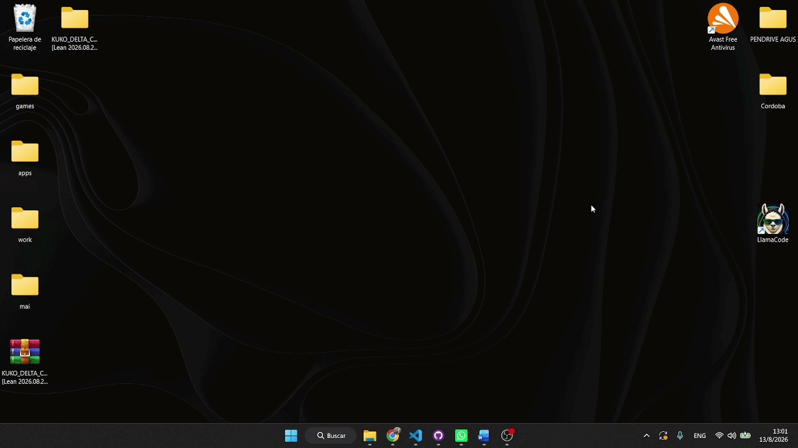

**Base documental**

Carpeta de instalación con el índice studia.db y el corpus en DATA_StudIA: es
todo lo que StudIA necesita.

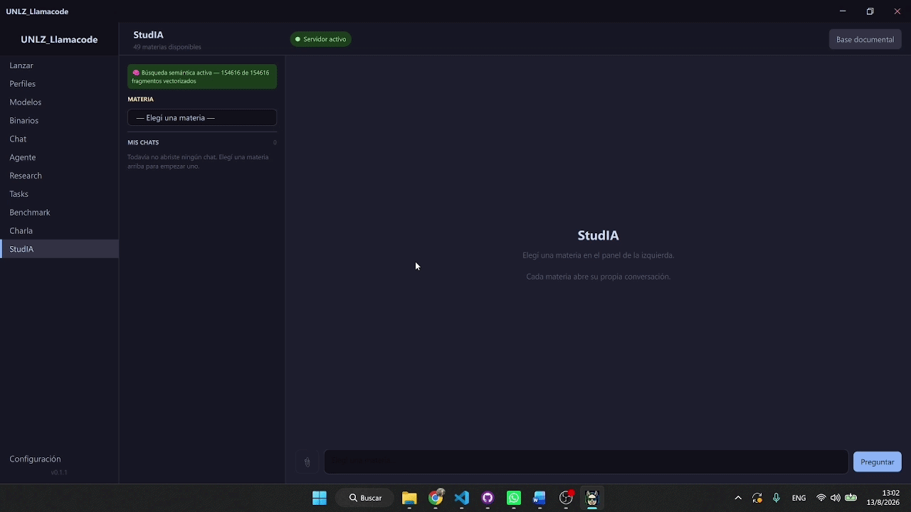

**Selección de materia**

El corpus está organizado por asignatura, en orden de cursada. Cada materia tiene su
propia conversación.

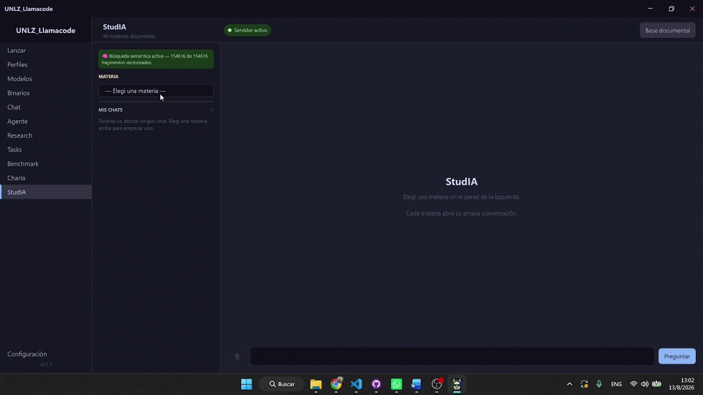

**Respuesta en modo conversación**

Pregunta en lenguaje natural y respuesta construida sobre los fragmentos
recuperados del material, con sus fuentes al pie.

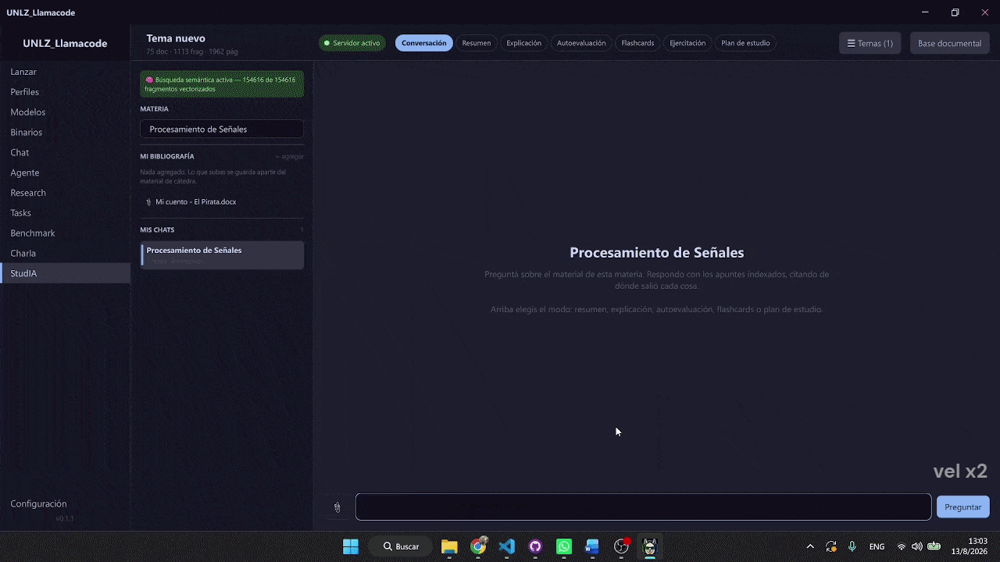

**De la cita al documento original**

Un click en la referencia abre el PDF del que salió la afirmación. Esta es la
trazabilidad que justifica el proyecto: toda respuesta se puede verificar contra
el apunte.

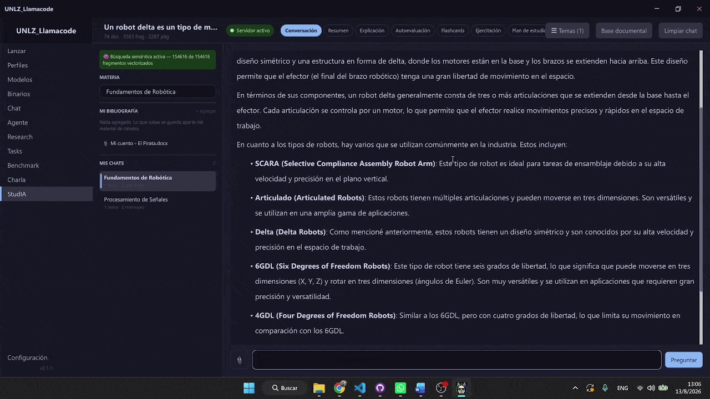

**Modos de tutor: resumen y autoevaluación**

Se le dieron dos consignas distintas al modelo, para mostrar algunos de sus modos.

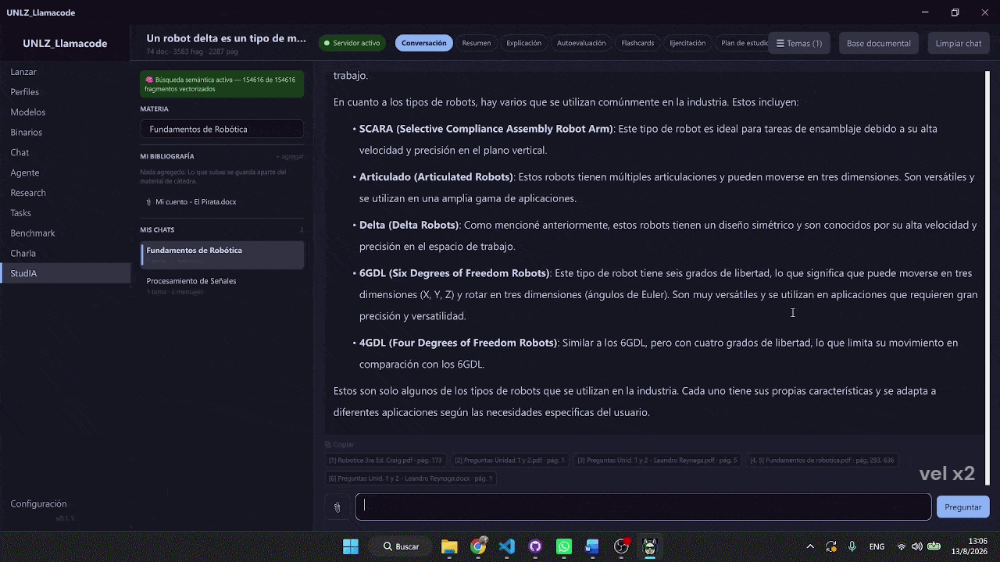

---

### Capturas

**1. Pantalla principal de StudIA** — materia seleccionada y respuesta en modo explicación.

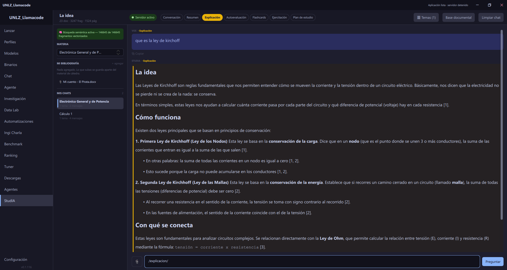

**2. Barra de modos** — conversación, resumen, explicación, autoevaluación, flashcards,
ejercitación y plan de estudio.

**3. Citas agrupadas por documento** — los PDF de donde sale la información.

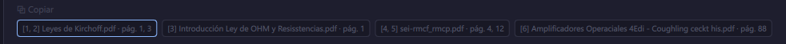

**4. Gráfico de función** — figura generada con matplotlib.

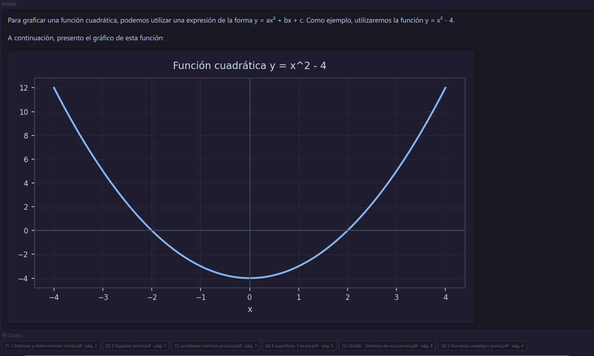

**5. Diagrama Mermaid** — diagrama renderizado mediante mermaid-cli.

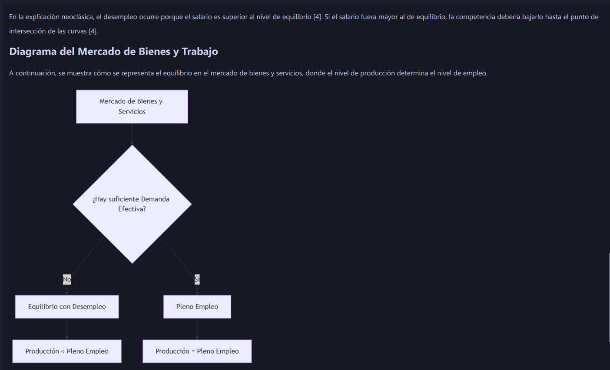

**6. Flashcards** — exportables en Anki.

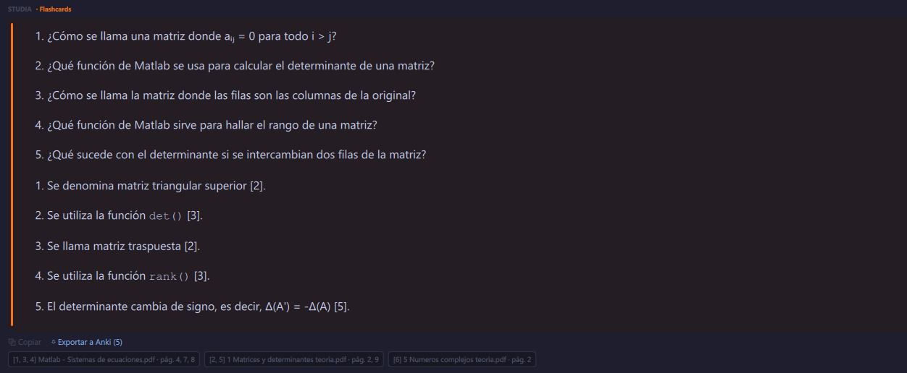

**7. Abstención ante una pregunta fuera del corpus** — informa que no
tiene información suficiente.

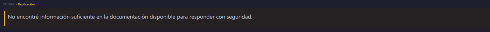

---

## Documentación

La documentación formal de la PPS.

| Documento | Archivo |
|---|---|
| Informe de PPS | [`Documentación/Informe_PPS_StudIA.pdf`](Documentaci%C3%B3n/Informe_PPS_StudIA.pdf) |
| Diagrama de Gantt | [`Documentación/Diagrama_de_Gantt.xlsx`](Documentaci%C3%B3n/Diagrama_de_Gantt.xlsx) |
| Manual de usuario | [`Manuales/Manual_de_Usuario.pdf`](Manuales/Manual_de_Usuario.pdf) |

---

## Autor

<table>
<tr> 

### DE PALMA, Marcos Agustín

Ingeniería Mecatrónica — FI-UNLZ

📧 <marcosdepalma03@gmail.com>

💻 GitHub [@MarcosDePalma](https://github.com/MarcosDePalma)

</td></tr>
</table>

---

**UNLZ_LLAMACODE_STUDIA**

**Facultad de Ingeniería — Universidad Nacional de Lomas de Zamora** 
PPS · 2026 · 1.er Cuatrimestre

